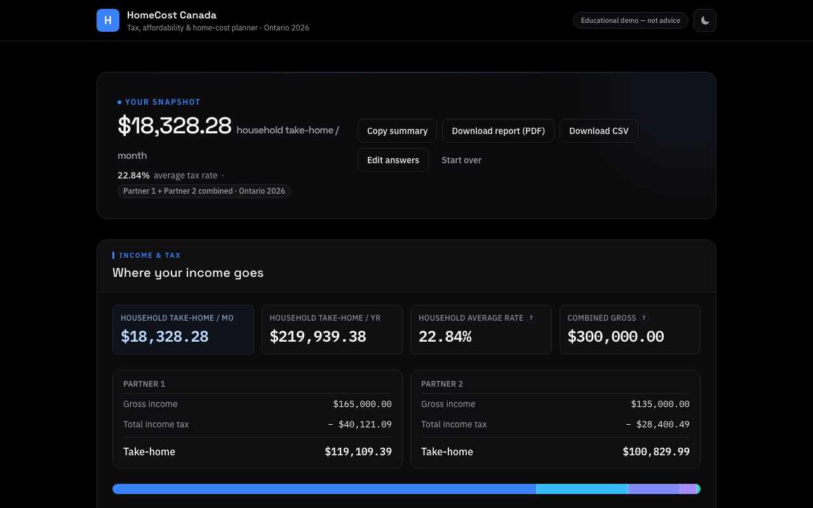
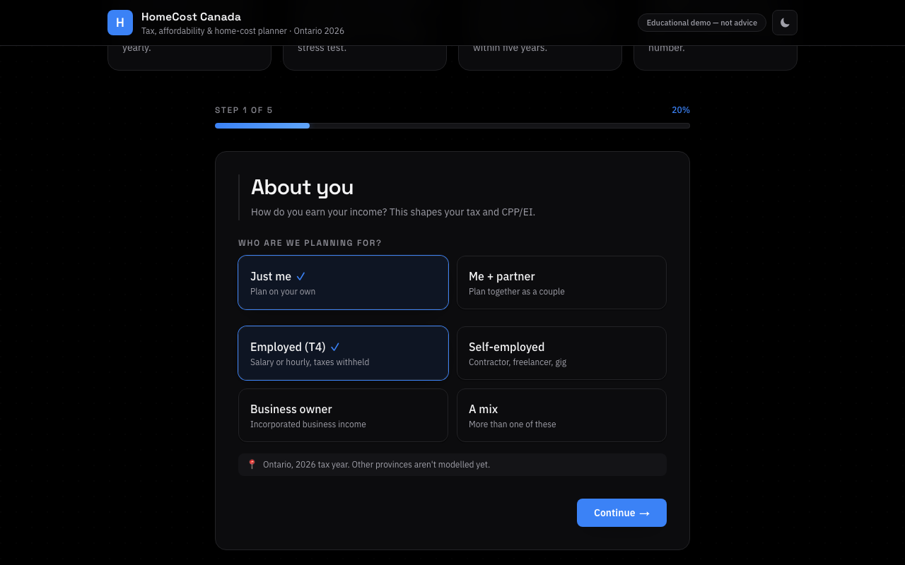
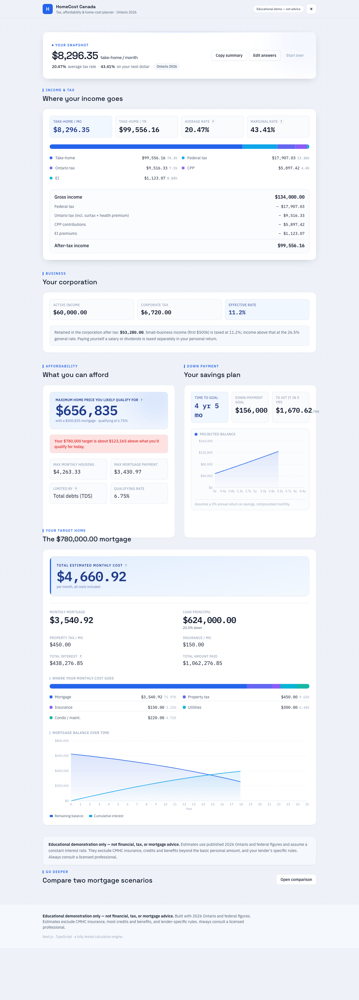
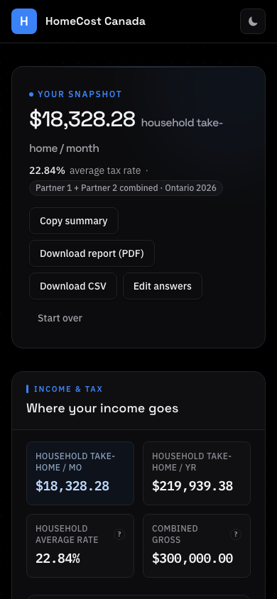

<div align="center">

# 🏠 HomeCost Canada

**See exactly what you can afford — solo or as a couple.**

Ontario 2026 tax · home affordability · total home-cost planner

[**Live demo →**](https://air-finance-calculator.vercel.app)

[](https://github.com/anujraja/HomeCost-Canada/actions/workflows/ci.yml)
[](LICENSE)
[](https://nextjs.org)
[](tsconfig.json)
[](#testing)

<br />



<sub>Couple mode: two incomes taxed individually, one household picture — in the pure-black OLED dark theme.</sub>

</div>

---

A guided planner for anyone — an employee, a contractor, a one-person founder,
or a **couple planning together** — to understand their money in one place:
take-home pay after Ontario + federal tax and CPP/EI, the home price they
actually qualify for, how long it will take to save a down payment, and the
full monthly cost of the home they're eyeing. Answer a few grouped questions
(or hit **Demo**) and get a clear analysis you can **download as a PDF report
or CSV**.

> **Educational demonstration only — not financial, tax, or mortgage advice.**
> Estimates use published 2026 Ontario and federal figures and assume a constant
> interest rate. They exclude CMHC insurance, most credits and benefits, and
> lender-specific rules. Ontario is the only province modelled.

---

## ✨ Highlights

- **Solo or couple** — a "Just me / Me + partner" toggle. Each partner's income
  is taxed individually (as the CRA does), then combined into one household
  take-home and a joint affordability read. Two earners on $300k net
  measurably more than one earner on $300k — and the app shows it.
- **Real Ontario 2026 math** — federal + provincial brackets, surtax, health
  premium, CPP/CPP2, EI, the small-business corporate rate, GDS/TDS ratios,
  and the federal mortgage stress test. Every constant is sourced.
- **Export anywhere** — a print-perfect PDF report and a raw-numbers CSV,
  plus a one-click text summary.
- **OLED dark theme** — a pure-black dark mode with measured WCAG AA contrast
  on every text pairing, and a considered light theme to match.
- **Resilient by design** — the pure, isomorphic engine runs in serverless
  routes *and* falls back to computing locally if the network dies, so users
  always get a result.
- **Fully responsive** — designed and tested down to a 320 px viewport.

## 📸 Screenshots

| Wizard (dark) | Analysis (light) | Mobile |
| :---: | :---: | :---: |
|  |  |  |

More in [`./screenshots`](screenshots) — regenerate any time with
`npx playwright test screenshots`.

---

## Quick start

```bash
npm install
npm run dev            # http://localhost:3000
```

| Command | What it does |
| --- | --- |
| `npm run dev` | Dev server |
| `npm run build` | Production build |
| `npm run start` | Serve the production build |
| `npm run lint` / `npm run typecheck` | ESLint / strict `tsc --noEmit` |
| `npm run test` | Vitest unit tests |
| `npm run test:e2e` | Playwright flows (auto-builds & serves on :3100) |
| `npm run check` | lint + typecheck + unit + build |

> Browser tests need Chromium once: `npx playwright install chromium`.

---

## What it does

1. **Onboarding wizard** — five short, grouped steps (about you · income ·
   savings & debts · home goal · home costs) with per-step validation, a
   progress bar, comma-grouped clearable inputs, inline hints, and a one-click
   **Demo** (solo or couple) that fills everything and jumps to the analysis.
2. **Analysis dashboard**
   - **Income & tax** — federal + Ontario tax, CPP/CPP2, EI, take-home per
     month/year, average and marginal rates, with a visual breakdown — and a
     per-partner split in couple mode.
   - **Business** (if you have incorporated income) — corporate small-business
     tax and what's retained.
   - **Affordability** — the maximum home price you'd qualify for using lender
     GDS/TDS ratios and the federal stress test on combined household income,
     and whether your target fits.
   - **Down-payment plan** — how long to reach your goal, with a projection chart
     and the monthly amount needed to hit it in five years.
   - **Your target home** — monthly mortgage, total monthly cost, total interest,
     a payment breakdown, and a yearly amortization chart.
3. **Export** — **Download report (PDF)** renders the analysis as a clean
   print document; **Download CSV** exports every input and result as raw
   numbers; **Copy summary** puts a text digest on the clipboard.
4. **Mortgage comparison** — a deep-dive tool to compare two mortgage scenarios
   side by side (monthly and lifetime differences), seeded from your profile.

---

## Architecture

```
src/
  lib/
    engine/            # UI-independent mortgage math (Canadian semi-annual convention)
    tax/               # UI-independent Ontario 2026 tax & finance engine
      constants.ts     #   every 2026 figure, with sources
      incomeTax.ts     #   federal + Ontario tax, CPP/CPP2, EI, surtax, health premium
      corporate.ts     #   CCPC small-business vs general corporate tax
      affordability.ts #   income → max home price (GDS/TDS + stress test)
      savings.ts       #   down-payment goal timeline
      profile.ts       #   unified Zod schema + analyzeProfile orchestrator
                       #   (single & couple households; per-partner tax)
    export.ts          # pure CSV report builder
    persistence/       # ScenarioStore interface (+ localStorage impl)
    useCalculation.ts  # mortgage-compare hook (validate → debounce → API)
  app/
    api/calculate/     # serverless mortgage endpoint (Zod-validated)
    api/analyze/       # serverless full-profile analysis endpoint
    page.tsx           # wizard ↔ analysis orchestration
  components/          # wizard/, analysis/, and shared UI
e2e/                   # Playwright flows + screenshot capture
```

**Design principle:** every calculation lives in `src/lib/engine` and
`src/lib/tax`, free of any React/Next import, so the math is unit-testable in
isolation and reused identically on the client and in the serverless routes. The
UI never does arithmetic.

**Resilience:** because that engine is pure and isomorphic, the app calls the
serverless `/api/analyze` route first (which re-validates input and runs the
same engine server-side) but falls back to computing locally if the network or
function is ever unavailable — so the user always gets a result. Input is
validated with the shared Zod schema on the client before submission, so invalid
data never reaches the wire. Covered by an e2e test that forces the API to 500.

**Couple mode:** Canada taxes individuals, not households — so each partner runs
through the full income-tax engine separately, take-home is summed, and only
affordability (a lender calculation) uses combined gross income. Profiles saved
before couple mode existed still parse: every new field has a schema default.

---

## The numbers (2026, sourced)

All figures live in [`src/lib/tax/constants.ts`](src/lib/tax/constants.ts) with
source links. Highlights:

- **Federal** brackets 14 / 20.5 / 26 / 29 / 33%; BPA $16,452 (phasing to $14,829
  for top-bracket incomes); lowest rate 14%.
- **Ontario** brackets 5.05 / 9.15 / 11.16 / 12.16 / 13.16%; BPA $12,989; surtax
  20% over $5,818 + 36% over $7,445; Ontario Health Premium.
- **CPP** YMPE $74,600, YAMPE $85,000 — employee 5.95% + CPP2 4% (max $4,646.45);
  self-employed pays both halves. **EI** MIE $68,900 at 1.63% (max $1,123.07).
- **Corporate** small-business rate 11.2% (fed 9% + ON 2.2%, eff. July 1 2026) up
  to $500k; 26.5% general above.
- **Mortgage** Canadian semi-annual compounding:
  `monthlyRate = (1 + annualRate/2)^(2/12) − 1`, standard amortizing payment with
  an explicit zero-rate branch. **Affordability** GDS 39% / TDS 44%, qualifying at
  `max(contract rate + 2%, 5.25%)`.

**Verification.** The engine is pinned by unit tests to hand-computed references:
$100,000 T4 → **$73,996 take-home**; the classic $500k @ 5% / 25yr mortgage →
**$2,908.02/month**; and a couple on $165k + $135k nets **$219,939/yr** — more
than a single earner on the same $300k, exactly as bracket math dictates. The
amortization schedule is checked to fully pay off.

---

## Assumptions & scope (stated, not hidden)

- Constant interest rate; monthly (not accelerated) payments.
- Property tax/insurance entered annually, spread evenly by 12.
- Personal credits beyond the basic personal amount, and most benefits, are not
  modelled. CPP credit-vs-deduction split follows CRA rules; the mixed
  employment/self-employment split is a documented approximation.
- Partner 2 models personal income (employment, self-employment, other, RRSP);
  incorporated business income is modelled for the primary applicant.
- **Deliberately out of scope** (would need verified primary sources / would be
  advice): CMHC premium tables, qualification/stress-test edge rules beyond the
  headline ratios, land-transfer tax, and personal salary-vs-dividend integration.

---

## Testing

- **Unit (Vitest, 130 tests):** the mortgage engine, the tax engine (reference
  take-home cases, CPP/EI maximums, surtax, health premium, BPA phase-out),
  corporate tax, affordability, savings, couple-household math, the CSV export
  builder, both Zod schemas, the persistence store, and both API routes.
- **Browser (Playwright, 13 flows):** demo → full analysis; manual wizard
  step-through (solo and couple); wizard validation; the mortgage comparison;
  comma-grouped number entry; CSV download; and a mobile-viewport flow that
  asserts zero horizontal overflow.
- **Screenshots:** `npx playwright test screenshots` writes the wizard and
  analysis at 1280 / 768 / 390 / 320 into `./screenshots`.

CI runs the full gate — lint, strict typecheck, unit tests, production build,
and the Playwright suite — on every push and pull request.

---

## Persistence & deployment

The wizard profile is saved to `localStorage` so a return visit starts where you
left off. Named-scenario storage sits behind a backend-agnostic `ScenarioStore`
interface ([`src/lib/persistence`](src/lib/persistence)); the Postgres notes
below show the swap.

<details>
<summary>Postgres swap (schema + steps)</summary>

```sql
create table profiles (
  id         uuid primary key default gen_random_uuid(),
  name       text not null,
  profile    jsonb not null,   -- validated FinancialProfile
  saved_at   timestamptz not null default now()
);
```

Implement `PostgresStore implements ScenarioStore`, re-validate with the Zod
schema server-side before writing, and swap the store construction. Connection
strings go in `DATABASE_URL` (env only; `.env*` is git-ignored, and no secrets
are committed).
</details>

**Vercel:** deployed at
[air-finance-calculator.vercel.app](https://air-finance-calculator.vercel.app) —
standard Next.js App Router, default build; `/api/calculate` and `/api/analyze`
run as serverless functions.

---

## Tech stack

Next.js 16 (App Router) · React 19 · TypeScript (strict, `noUncheckedIndexedAccess`)
· Tailwind CSS v4 · Zod · Recharts · Vitest · Playwright.

## Contributing

Issues and PRs are welcome — see [CONTRIBUTING.md](CONTRIBUTING.md). The one
house rule: **the UI never does arithmetic**; all math lives in the pure,
unit-tested engine.

## License

[MIT](LICENSE) © [Anuj Raja](https://anujraja.com)

---

<div align="center">
<sub>Built by <a href="https://anujraja.com"><b>Anuj Raja</b></a> 🇨🇦 🇮🇳 · <a href="https://github.com/anujraja">GitHub</a> · <a href="https://air-finance-calculator.vercel.app">Live demo</a></sub>
</div>
